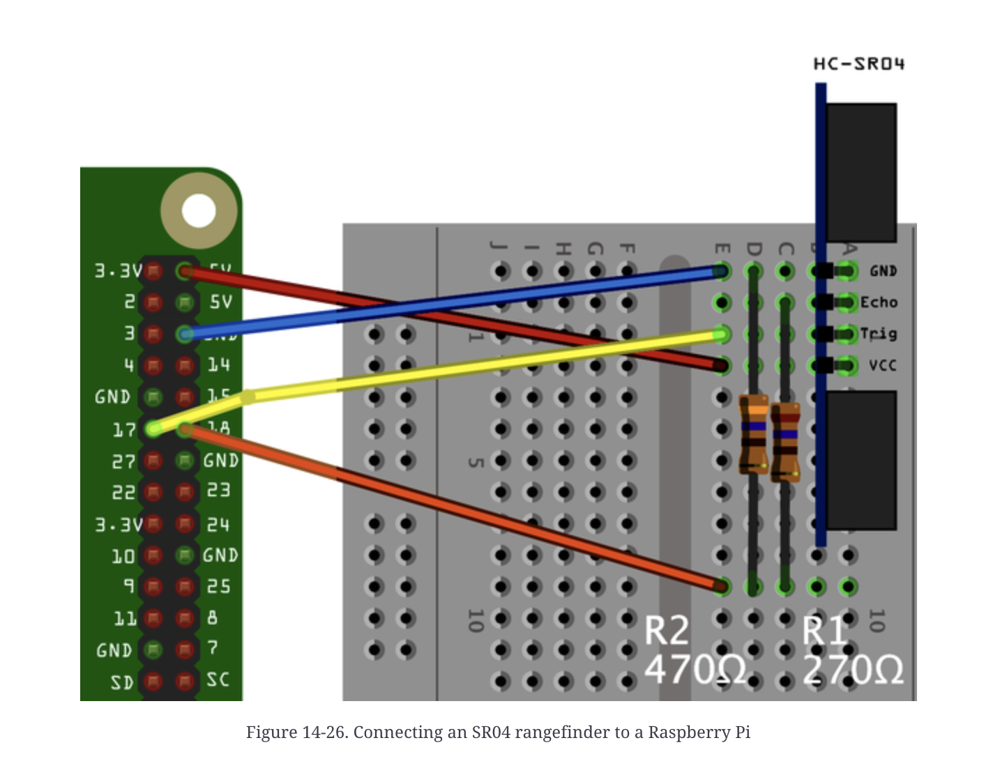

# Touchless Pong

A Raspberry Pi powered Pong game controlled by hand movement using an ultrasonic distance sensor.

This project includes a web interface for game setup, and LED status indicator, sound effects, email notifications with game results, and ThingSpeak IoT analystics to track game results over time.

## Features:

- **Gesture Control** - Move in-game paddle by moving your hand in front of the HC-SR04 ultrasonic sensor
- **Control Modes** - Option to play with arrow keys or ultrasonic sensor
- **Web Interface** - Choose your controller, start games, and view game history analytics
- **LED Indicator** - Green LED lights up while game is in progress
- **Sound Effects** - Audio feedback for countdown, scoring, losing a point, winning, and losing
- **Email Notifications** - Optionally input email and recieve your game results via email after each match
- **ThingSpeak Analytics** - Game stats are logged to ThingSpeak for game history visualization

## Hardware and Software Installation

**Hardware** :
- Raspberry Pi 4 Model B
- HC-SR04 Ultrasonic Distance Sensor
- 1x green LED
- 270 and 2x 470 Ohm resistors
- At least 6 jumper wires
- small speaker (connected via 3.5mm audio jack)
- breadboard
- Monitor connected to Pi or Virtual Network Computing (VNC) Software
- Keyboard and mouse
- Optional but recommended table tennis paddle or any flat surface instead of using just your hand for best sensor feedback

**Wiring** *(important if you are not planning on changing pin variables in code)*
- HC-SR04 Wiring

Taken from Raspberry Pi Cookbook, 3rd Edition, Simon Monk

- LED wiring
green LED is connected to GPIO pin 22 through 470 Ohm resistor, then to ground

- Speaker
This is just connected via the RPi's built-in audio jack

**Software Setup**
You will need:
Pygame, gpiozero, Bottle, pifpio, ThingSpeak
1. clone the repo and `cd touchless-pong`
2. install dependencies listed in dependencies.txt
3. on RPi start the pigpiod daemon with `sudo pigpiod` and to start automatically on boot `sudo systemctl enable pigpiod`
4. set audio output to 3.5mm jack on RPi
5. configure environment variables with `cp .env.example .env` and edit .env with your values
*must generate app password from google and create thingspeak account*

**Running the Game**
1. to run with web interface, in terminal put `python3 src/web_page.py` and open http://raspberrypi.local:8080 on any device that is on the same network as the RPi
2. run directly from terminal with `python3 src/main.py` in terminal, bypasses web interface and starts game with distance sensor as controller automatically

